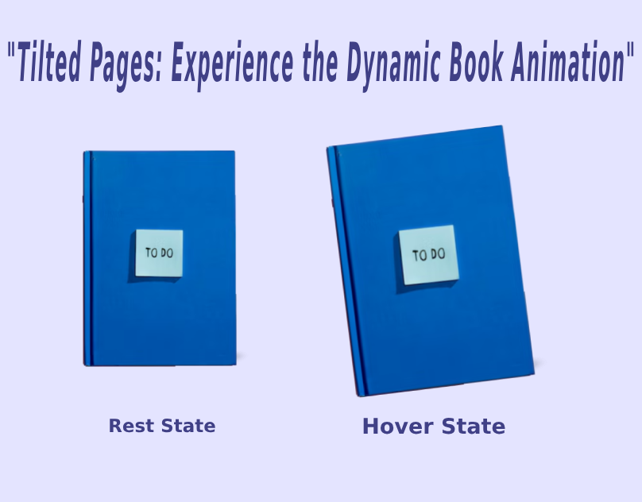

# 📚 Tilted Pages: A Dynamic Book 

<a href="https://www.linkedin.com/in/dharmendraverma95/" target="_blank">LinkedIn Profile </a>

<a href="https://www.behance.net/dhirukumar" target="_blank">Behance Profile </a>

# Project Overview
**📚 Tilted Pages** 
Tilted Pages is an interactive web project that brings a unique book animation effect to life. The project features a stylized, skewed book design that animates into a vertical position when hovered over. This dynamic effect enhances user interaction and can add a visually engaging element to any web page or portfolio.

## Desgin 
<ul>
  <li>Hero Banner</li>
  <li>Banner Background Image Effect, Banner title and Prodcut animation and Slider animation </li>
</ul>

## 🚀 Project Features

🎯 Skewed Book Position: The book appears tilted initially to create a dynamic visual cue.
✨ Hover Animation: Smooth animation transitions the book to a vertical position on hover.
🎨 CSS-Based Animation: All animations are powered by CSS3, ensuring performance and compatibility.
📱 Responsive Design: Fully responsive layout that adapts to various screen sizes and devices.
⚙️ Customizable: Easily tweak tilt angles, animation durations, and other properties to fit your branding or project needs.

## 🎨 Design Elements

🔸 Hero Banner
🔸 Background Image Effects
🔸 Animated Banner Title & Product
🔸 Interactive Slider Animation

## 🛠️ Built With
HTML5
CSS3
Bootstrap 5.3
Font Awesome
Google Fonts
Adobe XD (for UI/UX design)
Freepik (for images)
ChatGPT (for content generation)

 
Desktop Desgin 

 
Mobile Desgin 

  
Desktop Desgin ui-ux Layout 

 
ui-ux Layout Mobile Desgin 

  
Desktop Desgin 

 
Mobile Desgin 

Cover 
